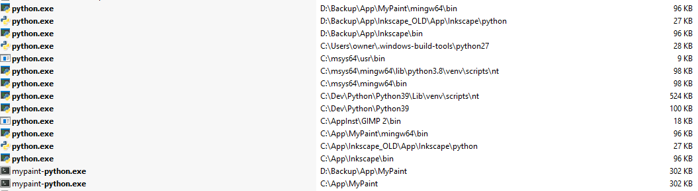

# Windows 10 でビルド

- 目的
  - build ディレクトリを gitignore せずに、powershell などでそのまま実行できるように

## powershell から実行

- MinGW64 の python.exe をフルパスで指定する

```powershell
cd C:/ws/mypaint

C:\msys64\mingw64\bin\python.exe setup.py

C:\msys64\mingw64\bin\python.exe .\build\scripts-3.8\mypaint.py
```

## python が PC内に何個もある場合は注意



## エラー発生

- `build/lib.mingw-3.8/_mypaintlib-cpython-38.dll` を `lib/_mypaintlib-cpython-38.dll` へコピーすると治る

```powershell
Traceback (most recent call last):
  File ".\build\scripts-3.8\mypaint.py", line 287, in <module>
    main.main(
  File ".\gui\main.py", line 237, in main
    run()
  File ".\gui\main.py", line 193, in run
    from gui import application
  File ".\gui\application.py", line 49, in <module>
    import lib.document
  File ".\lib\document.py", line 28, in <module>
    from lib.fileutils import safename
  File ".\lib\fileutils.py", line 25, in <module>
    import lib.helpers
  File ".\lib\helpers.py", line 25, in <module>
    from . import mypaintlib
  File ".\lib\mypaintlib.py", line 13, in <module>
    from . import _mypaintlib
ImportError: cannot import name '_mypaintlib' from 'lib' (.\lib\__init__.py)
```